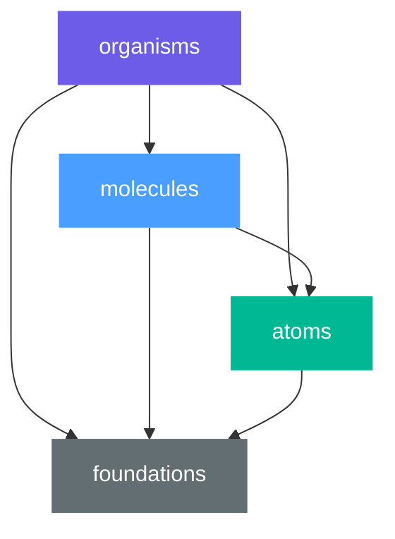

# Atomic Design

This guide describes a **suggested** architecture for UI component libraries.

It is not required. You are free to organize your components however you see fit. This document offers one approach — Atomic Design — that tends to keep component libraries consistent and composable as they grow.

## Overview

[Atomic Design](https://bradfrost.com/blog/post/atomic-web-design/) is a methodology for building UI systems. Components are classified by complexity into layers, where higher layers compose lower ones.

The core ideas are:

- **Components are classified by complexity**, not by feature
- **Lower layers are simpler and more reusable**
- **Higher layers compose lower ones** — never the reverse
- **Foundations** provide shared primitives (theme, tokens, utilities)

## Layers

A UI library using this approach has the following structure inside `src/`:

```tree
src/
├── foundations/               # Shared primitives (theme, tokens, utilities)
├── components/
│   ├── atoms/                 # Smallest building blocks
│   ├── molecules/             # Compositions of atoms
│   └── organisms/             # Complex compositions of molecules and atoms
└── index.ts                   # Public API of the library
```

### Foundations

Shared primitives that components depend on: theme controller, design tokens, CSS conventions, and low-level utilities. Foundations have no dependencies on components.

### Atoms

The smallest, indivisible UI elements. Each atom does one thing and is fully self-contained.

**Examples:** `Button`, `Input`, `Badge`, `Switch`, `CheckBox`, `Loading`

```tree
atoms/
├── Button.tsx                 # Button component
├── Input.tsx                  # Text input component
├── Badge.tsx                  # Status badge
├── Switch.tsx                 # Toggle switch
└── index.ts                   # Public exports
```

Atoms depend only on foundations. They never import from molecules or organisms.

### Molecules

Compositions of atoms that form a functional unit. A molecule combines two or more atoms to accomplish a specific task.

**Examples:** `TextInput` (label + input + error), `DatePicker` (input + calendar), `Select` (input + dropdown), `RadioGroup` (label + radio buttons)

```tree
molecules/
├── TextInput.tsx              # Label + Input + validation
├── DatePicker.tsx             # Input + calendar popup
├── Select.tsx                 # Input + dropdown list
├── RadioGroup.tsx             # Label + RadioButton collection
└── index.ts                   # Public exports
```

Molecules depend on atoms and foundations. They never import from organisms.

### Organisms

Complex, self-contained sections of UI composed of molecules and atoms. Organisms are the most feature-specific layer in the library.

**Examples:** `DataGrid` (headers + rows + sorting + pagination), `Table` (headers + cells + selection)

```tree
organisms/
├── DataGrid.tsx               # Full data grid with sorting and pagination
├── Table.tsx                  # Table with headers, rows, and selection
└── index.ts                   # Public exports
```

Organisms depend on molecules, atoms, and foundations.

## Dependency Rules



| Layer | Can import from |
| - | - |
| `organisms/` | `molecules/`, `atoms/`, `foundations/` |
| `molecules/` | `atoms/`, `foundations/` |
| `atoms/` | `foundations/` |
| `foundations/` | nothing (external packages only) |

**Dependencies flow downward only.** An atom never imports from a molecule. A molecule never imports from an organism. This guarantees that lower-level components remain reusable without pulling in unrelated complexity.

## Component Structure

Each component is a single file or a directory when it needs co-located styles:

```tree
[Component]/
├── [Component].tsx            # Component logic and JSX
├── [Component].module.css     # Scoped styles (CSS Modules)
└── index.ts                   # Public export
```

For simple components that do not need scoped styles, a single file is sufficient:

```tree
atoms/
├── Badge.tsx                  # No separate styles needed
└── index.ts
```

## Headless vs Styled

A library may offer two variants of its component hierarchy:

```tree
components/
├── headless/                  # Logic-only, no built-in styles
│   ├── atoms/
│   ├── molecules/
│   └── organisms/
└── styled/                    # Styled wrappers over headless components
    ├── atoms/
    ├── molecules/
    └── organisms/
```

**Headless** components provide behavior, accessibility, and state management without any visual styling. Consumers bring their own styles.

**Styled** components wrap headless ones with a default visual design. They depend on headless — never the reverse.

## Summary

- Classify components by complexity: atoms → molecules → organisms
- Dependencies flow downward only
- Foundations provide shared primitives with no component dependencies
- Keep atoms small and self-contained
- Molecules combine atoms into functional units
- Organisms compose molecules and atoms into complex sections
