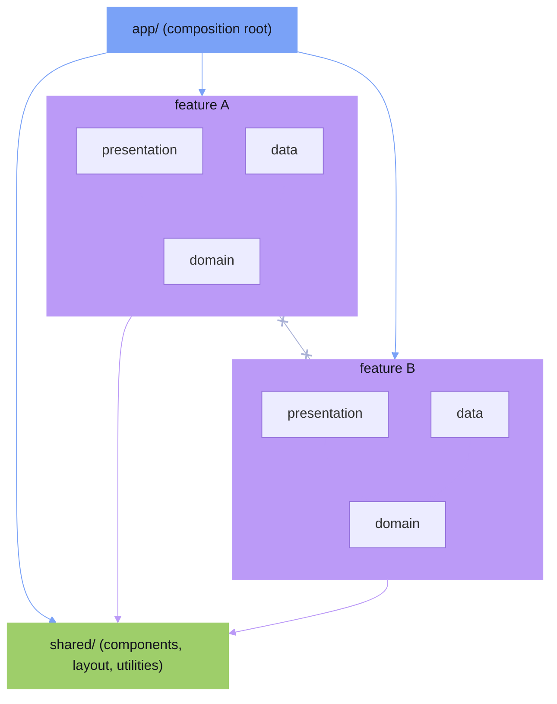

<!-- markdownlint-disable MD013 -->
# Architecture Guide

This guide describes a **suggested** architecture for Beat applications.

It is not required. Beat does not enforce any particular folder structure or design pattern. You are free to organize your code however you see fit. This document offers one approach — feature-centric **Ports & Adapters** architecture, organized with Feature-Sliced Design — that tends to scale well and keep codebases maintainable as they grow.

This architecture is inspired by the **Dependency Rule** from Robert C. Martin's Clean Architecture and Alistair Cockburn's Hexagonal Architecture (Ports & Adapters). Both share the same core principle:

> **Source code dependencies must always point inward, toward higher-level policies.**

Outer layers (UI, HTTP, databases) depend on inner layers (domain types, port interfaces). Inner layers never know about outer layers. This is the rule that makes the architecture work.

## Overview

The architecture has three layers inside each feature, all obeying the Dependency Rule. This maps to the inner rings of Uncle Bob's Clean Architecture:

| This architecture | Clean Architecture ring |
| - | - |
| `domain/types.ts` | Entities (domain data shapes) |
| `domain/ports.ts` | Use Case input/output boundaries (port interfaces) |
| `data/` repositories | Interface Adapters |
| `app/` router + http-client | Frameworks & Drivers / Composition Root |
| `shared/` components + utilities | Frameworks & Drivers / cross-cutting (no feature ownership) |

<!-- markdownlint-disable -->
<svg xmlns="http://www.w3.org/2000/svg" viewBox="0 0 820 378" style="max-width:100%;width:800px;height:auto;display:block;margin:1.5em auto">
  <style>
    .o-badge { font: 700 11px/1 system-ui,-apple-system,sans-serif; letter-spacing: 0.06em; }
    .o-sub   { font: 11px/1 system-ui,-apple-system,sans-serif; fill: var(--beat-ui-color-text-muted, #a9b1d6); }
    .o-note  { font: 11px/1 system-ui,-apple-system,sans-serif; fill: var(--beat-ui-color-text-muted, #a9b1d6); }
  </style>
  <defs>
    <marker id="arr-inward" markerWidth="8" markerHeight="6" refX="7" refY="3" orient="auto">
      <polygon points="0 0, 8 3, 0 6" fill="var(--beat-ui-color-text-muted, #a9b1d6)"/>
    </marker>
  </defs>
  <!-- APP ring — blue; rx=320 → 90px margins at cx=410 in 820px viewBox -->
  <ellipse cx="410" cy="190" rx="320" ry="148" stroke="#7aa2f7" stroke-width="1.5" fill="#7aa2f7" fill-opacity="0.05"/>
  <!-- PRESENTATION ring — purple -->
  <ellipse cx="410" cy="190" rx="242" ry="112" stroke="#bb9af7" stroke-width="1.5" fill="#bb9af7" fill-opacity="0.07"/>
  <!-- DATA ring — purple (slightly more opaque) -->
  <ellipse cx="410" cy="190" rx="165" ry="76"  stroke="#bb9af7" stroke-width="1.5" fill="#bb9af7" fill-opacity="0.10"/>
  <!-- DOMAIN ring — purple (innermost, most opaque) -->
  <ellipse cx="410" cy="190" rx="88"  ry="42"  stroke="#bb9af7" stroke-width="1.5" fill="#bb9af7" fill-opacity="0.15"/>
  <!-- App band label — 15px clear of APP ring stroke (top y=42) -->
  <text x="410" y="57"  text-anchor="middle" class="o-badge" fill="#7aa2f7">APP</text>
  <text x="410" y="71"  text-anchor="middle" class="o-sub">router.tsx · http-client.ts · composition root</text>
  <!-- Presentation band label — 15px clear of PRES ring stroke (top y=78) -->
  <text x="410" y="93"  text-anchor="middle" class="o-badge" fill="#bb9af7">PRESENTATION</text>
  <text x="410" y="107" text-anchor="middle" class="o-sub">components · event handlers · UI</text>
  <!-- Data band label — 15px clear of DATA ring stroke (top y=114) -->
  <text x="410" y="129" text-anchor="middle" class="o-badge" fill="#bb9af7">DATA</text>
  <text x="410" y="143" text-anchor="middle" class="o-sub">repositories · adapters · http-setup.ts</text>
  <!-- Domain center label -->
  <text x="410" y="184" text-anchor="middle" class="o-badge" fill="#bb9af7">DOMAIN</text>
  <text x="410" y="198" text-anchor="middle" class="o-sub">types.ts · ports.ts</text>
  <!-- Shared band label (bottom of APP band) — 14px clear of PRES ring bottom (y=302) -->
  <text x="410" y="316" text-anchor="middle" class="o-badge" fill="#9ece6a">SHARED</text>
  <text x="410" y="330" text-anchor="middle" class="o-sub">components · layout · utilities</text>
  <!-- Dependency direction annotation -->
  <line x1="630" y1="355" x2="553" y2="355"
        stroke="var(--beat-ui-color-text-muted, #a9b1d6)" stroke-width="1"
        marker-end="url(#arr-inward)"/>
  <text x="635" y="359" class="o-note">dependencies point inward</text>
</svg>
<!-- markdownlint-enable -->

<!-- markdownlint-disable MD013 -->
> **Note on Use Cases:** Uncle Bob's Clean Architecture has a dedicated Use Cases ring between Entities and Interface Adapters, containing application-specific business logic — orchestrating entities, enforcing rules like "only confirmed users may check out." This architecture omits that ring intentionally. For a documentation or data-fetching application there is no such logic; adding a Use Cases layer would be pure ceremony. If your feature grows logic that doesn't belong in a domain type and isn't adapter glue, that is the signal to introduce a `use-cases/` layer. See [When to Add Use Cases](#when-to-add-use-cases) below.

The core ideas are:

- **Vertical feature slices** instead of horizontal layers
- **The Dependency Rule** — source code dependencies always point inward
- **Domain models and ports** owned by each feature
- **A composition root** that wires everything together

## Layers

A Beat application using this approach has three top-level layers inside `src/`:

```tree
src/
├── app/            # Composition root, routing, global setup
├── features/       # Feature modules (vertical slices)
└── shared/         # Reusable utilities and UI shared across features
```

### `app/`

The application shell. This is the only layer that knows about all features and wires them together.

- **`main.tsx`** — Entry point. Renders the root component.
- **`router.tsx`** — Composition root. Instantiates repositories and injects them into components as port interfaces. Defines routes.
- **`http-client.ts`** — Infrastructure setup. Creates the HTTP client and calls each feature's endpoint registration function.
- **`theme.ts`** — Global concerns like theme state.
- **`env.d.ts`** — Type declarations for non-TS assets (e.g. `.md`, `.module.css`).

The `app/` layer imports from `features/` and `shared/`. No other layer imports from `app/`.

### `features/`

Each feature is a self-contained vertical slice with its own domain, data, and presentation layers:

```tree
features/
└── [feature]/                             # One directory per feature
    ├── domain/                            # Types and port interfaces
    │   ├── types.ts                       # Domain models (pure data)
    │   ├── ports.ts                       # Repository interfaces (contracts)
    │   └── index.ts                       # Public exports for domain
    ├── data/                              # Port implementations and static fixtures
    │   ├── data.ts                        # Static fixtures typed against domain models
    │   ├── [feature]-repository.ts        # HTTP adapter implementing the port
    │   ├── http-setup.ts                  # Registers this feature's endpoints on the HTTP client
    │   └── index.ts                       # Public exports for data
    ├── presentation/                      # Beat components
    │   ├── components/                    # Feature-scoped child components
    │   │   └── [Component]/               # One directory per component
    │   │       ├── [Component].tsx        # Component logic and JSX
    │   │       ├── [Component].module.css # Component styles
    │   │       └── index.ts               # Public export for component
    │   ├── [Feature]Page.tsx              # Page-level component (route entry)
    │   ├── [Feature]Page.module.css       # Page styles
    │   └── index.ts                       # Public exports for presentation
    └── index.ts                           # Public API of the feature
```

**Domain** contains pure data types and port interfaces. Types are plain data shapes — no framework imports, no behavior. Ports are interfaces that define what the application needs from the outside world (data access, external APIs). The domain layer has zero dependencies on any outer layer.

> In Uncle Bob's full Clean Architecture, the innermost ring (Entities) contains **rich business objects with behavior** — classes with methods that enforce business rules like `order.confirm()` or `invoice.total()`. This architecture uses plain data shapes in `types.ts` because a typical Beat application has no enterprise-wide business rules to encapsulate. If your domain grows objects with meaningful behavior, model them as classes in `domain/` — keeping that logic out of data and presentation layers is exactly what the Dependency Rule protects.

**Data** implements the ports defined in domain. It has three responsibilities, each in its own file: static fixtures (`data.ts`), the HTTP adapter that fulfills the port contract (`[feature]-repository.ts`), and endpoint registration for the mock client (`http-setup.ts`). Data depends on domain only.

**Presentation** contains Beat components. It depends on domain types and shared utilities. It does not import from data directly — data flows in through props from the composition root.

### `shared/`

Reusable code that is not feature-specific: layout components, generic widgets, utilities.

```tree
shared/
├── components/                    # Atomic UI components shared across features
│   └── [Component]/
│       ├── [Component].tsx        # Component logic and JSX
│       ├── [Component].module.css # Component styles
│       └── index.ts               # Public export
├── layout/                        # App-wide layout components
│   ├── Layout.tsx                 # Page layout shells (e.g. with/without sidebar)
│   ├── Navbar.tsx                 # Top navigation bar
│   └── index.ts                   # Public exports
└── [module]/                      # Reusable widgets or utilities
    ├── [Module].tsx               # Component logic and JSX
    └── index.ts                   # Public exports
```

`shared/` must not import from `features/` or `app/`.

## The Dependency Rule

The single rule that makes this architecture work, stated directly by Uncle Bob:

> **"Source code dependencies can only point inwards. Nothing in an inner circle can know anything at all about something in an outer circle."**

In practice:

- `domain/` never imports from `data/`, `presentation/`, or `app/`
- `data/` never imports from `presentation/` or `app/`
- `presentation/` never imports from `data/` or `app/`
- `shared/` never imports from `features/` or `app/`
- Features never import from other features

The composition root (`app/`) is the only place allowed to import from all layers — its job is to wire them together.

## Dependency Diagram



| Layer | Can import from |
| - | - |
| `app/` | `features/`, `shared/`, external packages |
| `features/*` | own internals, `shared/`, external packages |
| `shared/` | other `shared/` modules, external packages |

**Features cannot import from other features.** If feature A needs data or UI from feature B, the `app/` layer imports from both features' public APIs and injects the dependency through props. Features never reference each other directly — they only receive typed values from the composition root.

**Each feature exports a public API** through its root `index.ts`. This is the only entry point other layers should import from. Everything not exported is internal — other layers must not reach into `domain/`, `data/`, or `presentation/` directly.

**Shared cannot import from features.** Shared code must be self-contained.

**Domain depends on nothing.** It defines types and interfaces only.

## Ports & Adapters Pattern

This architecture uses the **Ports & Adapters** pattern (also called Hexagonal Architecture). The domain layer defines *ports* — interfaces that describe what the application needs. The data layer provides *adapters* — concrete classes that fulfill those interfaces using a specific technology (HTTP, in-memory, file system).

The key insight: **the domain defines the contract, the adapter conforms to it.** The domain never knows how the adapter works.

Each feature defines one or more port interfaces in its domain layer. Ports are named after their contract, not their implementation, and follow Interface Segregation — each interface has a single focused responsibility:

```typescript
import type { [Feature] } from "./types";

export interface [Feature]Port {
  getAll(): Promise<readonly [Feature][]>;
}
```

If a feature has distinct data concerns, split them into separate ports rather than combining them into one:

```typescript
// features/[feature]/domain/ports.ts
export interface [Feature]ListPort {
  getList(): Promise<readonly [FeatureItem][]>;
}

export interface [Feature]DetailPort {
  getDetail(id: string): Promise<[FeatureDetail]>;
}
```

This follows the Interface Segregation Principle — components only depend on the methods they actually use.

Static fixtures live in `data/data.ts`, typed against domain models:

```typescript
// features/[feature]/data/data.ts
import type { [Feature] } from "../domain/types";

export const [FEATURE]_DATA: readonly [Feature][] = [
  { /* ... */ },
];
```

The repository is a pure HTTP adapter — no raw data, just a `get` call that fulfills the port contract:

```typescript
// features/[feature]/data/[feature]-repository.ts
import type { [Feature] } from "../domain/types";
import type { [Feature]Port } from "../domain/ports";
import type { HttpClient } from "../../../shared/lib/http/http-client";

export class Http[Feature]Repository implements [Feature]Port {
  constructor(private readonly http: HttpClient) {}

  async getAll(): Promise<readonly [Feature][]> {
    return this.http.get<readonly [Feature][]>("/api/[feature]/all");
  }
}
```

Endpoint registration is owned by the feature itself in `http-setup.ts`:

```typescript
// features/[feature]/data/http-setup.ts
import type { MockHttpClient } from "../../../shared/lib/http/http-client";
import { [FEATURE]_DATA } from "./data";

export function register[Feature]Endpoints(client: MockHttpClient): void {
  client.register("/api/[feature]/all", () => [FEATURE]_DATA);
}
```

This separation lets you swap implementations without changing the rest of the feature. The `Http` prefix signals the current transport — replace the class with a real fetch-backed implementation when an API is available, without touching ports, static data, or presentation.

## Composition Root

The `app/` layer has two files that together form the composition root:

**`http-client.ts`** creates the HTTP client and delegates endpoint registration to each feature:

```typescript
// app/http-client.ts
import { MockHttpClient } from "../shared/lib/http/http-client";
import { register[Feature]Endpoints } from "../features/[feature]/data/http-setup";

const client = new MockHttpClient(200);

register[Feature]Endpoints(client);
// ... one call per feature

export const httpClient = client;
```

This is open/closed: adding a new feature only requires a new `register*` call here — no knowledge of internal data structures.

**`router.tsx`** instantiates repositories and injects them as port interfaces into components:

```typescript
// app/router.tsx
import { httpClient } from "./http-client";
import { HttpFooRepository } from "../features/foo/data/foo-repository";
import { FooPage } from "../features/foo/presentation/FooPage";

const fooRepository = new HttpFooRepository(httpClient); // ← concrete class

const routes: readonly BeatRouteDefinition[] = [
  {
    path: "/foo/:slug",
    view: (match) => <FooPage match={match} fooPort={fooRepository} />, // ← injected as port
  },
];
```

-

```typescript
// features/foo/presentation/FooPage.tsx
import type { FooPort } from "../domain/ports"; // ← depends on port, not implementation

export interface FooPageProps {
  readonly match: BeatRouteMatch;
  readonly fooPort: FooPort; // ← port interface, not concrete class
}
```

The component never knows which implementation it receives — `HttpFooRepository` today, any other class tomorrow. The composition root decides.

Components never instantiate repositories or fetch data themselves. Data is fetched inside `onMount` using the injected port, keeping the dependency flow strictly one-directional and components trivially testable.

## When to Add Use Cases

For simple data-fetching features, presentation components can call port methods directly — the Dependency Rule is satisfied and no extra layer is needed.

But if your feature develops **application business logic** — rules that coordinate multiple ports, enforce constraints, or orchestrate a multi-step flow — introduce a `use-cases/` layer between `domain/` and `presentation/`:

```tree
features/[feature]/
├── domain/
├── use-cases/          # ← add when application logic emerges
│   └── [action].ts     # e.g. submit-order.ts, publish-review.ts
├── data/
└── presentation/
```

A use case receives ports via its constructor and orchestrates them:

```typescript
// features/[feature]/use-cases/[action].ts
import type { [Feature]Port } from "../domain/ports";
import type { [Feature]Input, [Feature]Output } from "../domain/types";

export class [Action]UseCase {
  constructor(private readonly port: [Feature]Port) {}

  async execute(input: [Feature]Input): Promise<[Feature]Output> {
    // Application logic here — not in the component, not in the adapter
    const data = await this.port.getAll();
    // validate, transform, coordinate multiple ports...
    return result;
  }
}
```

The presentation component receives the use case instead of the port directly. The composition root instantiates both the adapter and the use case and injects the use case into the component.

**Add a use case when:**

- A component makes multiple port calls and combines the results with non-trivial logic
- The same business rule appears in more than one component
- You need to enforce a constraint before persisting (e.g. "users may only submit once")
- You want to test application logic independently of the UI

**Skip the use case when:**

- The component fetches data and renders it — nothing more
- The use case body would just be `return this.port.getAll()` with no added logic

## Summary

- Organize code into `app/`, `features/`, and `shared/`
- Each feature owns its own domain, data, and presentation
- The Dependency Rule is non-negotiable: inner layers never import from outer layers
- Define focused port interfaces in domain (one responsibility each)
- Put static fixtures in `data/data.ts`, HTTP adapters in `data/*-repository.ts`, endpoint registration in `data/http-setup.ts`
- Wire everything in the composition root (`http-client.ts` + `router.tsx`)
- Inject ports as interfaces, never concrete classes
- Respect isolation: features are self-contained, shared is generic, app orchestrates
- Add a `use-cases/` layer only when application business logic emerges that belongs neither in the domain nor in an adapter

None of this is mandatory. Use what helps, skip what doesn't.

For the recommended architecture when building domain-specific libraries rather than applications, see [Plugin Architecture](./plugin-architecture).
