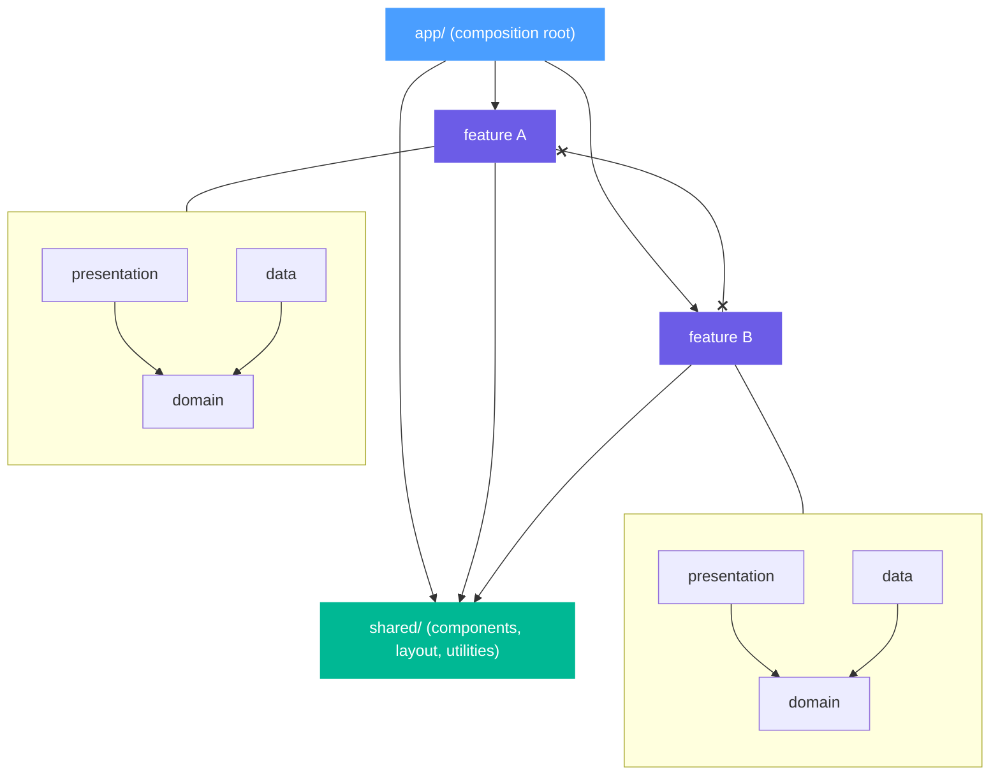

# Architecture Guide

This guide describes a **suggested** architecture for Beat applications.

It is not required. Beat does not enforce any particular folder structure or design pattern. You are free to organize your code however you see fit. This document offers one approach — feature-centric clean architecture — that tends to scale well and keep codebases maintainable as they grow.

## Overview

The architecture is inspired by [Feature-Sliced Design](https://feature-sliced.design) and clean architecture principles. The core ideas are:

- **Vertical feature slices** instead of horizontal layers
- **Explicit dependency rules** between layers
- **Domain models and ports** owned by each feature
- **A composition root** that wires everything together

## Layers

A Beat application using this approach has three top-level layers inside `src/`:

```tree
src/
├── app/            # Composition root, routing, global setup
├── features/       # Feature modules (vertical slices)
└── shared/         # Reusable utilities and UI shared across features
```

### `app/`

The application shell. This is the only layer that knows about all features and wires them together.

- **`main.tsx`** — Entry point. Renders the root component.
- **`router.tsx`** — Composition root. Instantiates repositories, loads data, defines routes.
- **`theme.ts`** — Global concerns like theme state.
- **`env.d.ts`** — Type declarations for non-TS assets (e.g. `.md`, `.module.css`).

The `app/` layer imports from `features/` and `shared/`. No other layer imports from `app/`.

### `features/`

Each feature is a self-contained vertical slice with its own domain, data, and presentation layers:

```tree
features/
└── [feature]/                             # One directory per feature
    ├── domain/                            # Types and port interfaces
    │   ├── types.ts                       # Domain models (pure data)
    │   ├── ports.ts                       # Repository interfaces (contracts)
    │   └── index.ts                       # Public exports for domain
    ├── data/                              # Port implementations (repositories)
    │   ├── [feature]-repository.ts        # Concrete repository implementation
    │   └── index.ts                       # Public exports for data
    ├── presentation/                      # Beat components
    │   ├── components/                    # Feature-scoped child components
    │   │   └── [Component]/               # One directory per component
    │   │       ├── [Component].tsx        # Component logic and JSX
    │   │       ├── [Component].module.css # Component styles
    │   │       └── index.ts               # Public export for component
    │   ├── [Feature]Page.tsx              # Page-level component (route entry)
    │   ├── [Feature]Page.module.css       # Page styles
    │   └── index.ts                       # Public exports for presentation
    └── index.ts                           # Public API of the feature
```

**Domain** contains pure types and port interfaces. It has no dependencies on Beat, external libraries, or other layers.

**Data** implements the ports defined in domain. Repositories handle data access — whether from an API, local storage, or in-memory. Data depends on domain only.

**Presentation** contains Beat components. It depends on domain types and shared utilities. It does not import from data directly — data flows in through props from the composition root.

### `shared/`

Reusable code that is not feature-specific: layout components, generic widgets, utilities.

```tree
shared/
├── components/                    # Atomic UI components shared across features
│   └── [Component]/
│       ├── [Component].tsx        # Component logic and JSX
│       ├── [Component].module.css # Component styles
│       └── index.ts               # Public export
├── layout/                        # App-wide layout components
│   ├── Layout.tsx                 # Page layout shells (e.g. with/without sidebar)
│   ├── Navbar.tsx                 # Top navigation bar
│   └── index.ts                   # Public exports
└── [module]/                      # Reusable widgets or utilities
    ├── [Module].tsx               # Component logic and JSX
    └── index.ts                   # Public exports
```

`shared/` must not import from `features/` or `app/`.

## Dependency Rules

These rules keep the architecture clean:



| Layer | Can import from |
| - | - |
| `app/` | `features/`, `shared/`, external packages |
| `features/*` | own internals, `shared/`, external packages |
| `shared/` | other `shared/` modules, external packages |

**Features cannot import from other features.** If feature A needs data or UI from feature B, the `app/` layer imports from both features' public APIs and injects the dependency through props. Features never reference each other directly — they only receive typed values from the composition root.

**Each feature exports a public API** through its root `index.ts`. This is the only entry point other layers should import from. Everything not exported is internal — other layers must not reach into `domain/`, `data/`, or `presentation/` directly.

**Shared cannot import from features.** Shared code must be self-contained.

**Domain depends on nothing.** It defines types and interfaces only.

## Repository Pattern

Each feature defines a port interface in its domain layer:

```typescript
// features/[feature]/domain/ports.ts
export interface [Feature]Repository {
  getAll(): Promise<readonly [Feature][]>;
}
```

The data layer provides an implementation:

```typescript
// features/[feature]/data/[feature]-repository.ts
import type { [Feature], [Feature]Repository } from "../domain"; // ← data/ imports from domain/

export class InMemory[Feature]Repository implements [Feature]Repository {
  async getAll(): Promise<readonly [Feature][]> {
    await new Promise((resolve) => setTimeout(resolve, 0));
    return [ /* ... */ ];
  }
}
```

This separation lets you swap implementations without changing the rest of the feature. Start with an in-memory repository for prototyping, then replace it with an HTTP-backed one when a real API is available.

## Composition Root

The `app/router.tsx` file acts as the composition root. It is the one place where repositories are instantiated and dependencies are wired together. The component depends on the port interface, not the concrete class:

```typescript
// app/router.tsx
import { InMemoryFooRepository, FooPage } from "../features/foo"; // ← app/ imports from features/

const fooRepository = new InMemoryFooRepository();

const routes: readonly BeatRouteDefinition[] = [
  {
    path: "/foo/:slug",
    view: (match) => <FooPage match={match} repository={fooRepository} />,
  },
];
```

```typescript
// features/foo/presentation/FooPage.tsx
import type { FooRepository } from "../domain";                 // ← depends on port, not implementation

export interface FooPageProps {
  readonly match: BeatRouteMatch;
  readonly repository: FooRepository;                            // ← port interface
}
```

The component never knows which implementation it receives — `InMemoryFooRepository` today, `HttpFooRepository` tomorrow. The composition root decides.

Components never instantiate repositories or fetch data themselves. This makes them easier to test and keeps the dependency flow one-directional.

## Summary

- Organize code into `app/`, `features/`, and `shared/`
- Each feature owns its own domain, data, and presentation
- Define ports in domain, implement them in data
- Wire everything in the composition root
- Use slots for cross-feature UI composition
- Respect the dependency rules: features are isolated, shared is generic, app orchestrates

None of this is mandatory. Use what helps, skip what doesn't.

For the recommended architecture when building domain-specific libraries rather than applications, see [Plugin Architecture](./plugin-architecture).
