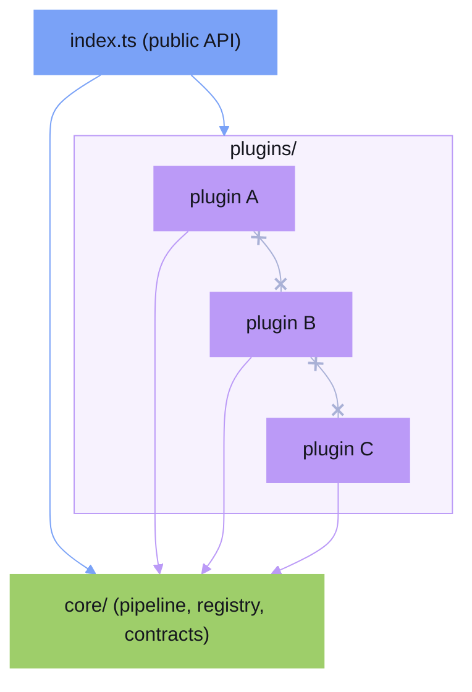

<!-- markdownlint-disable MD013 -->
# Plugin Architecture

This guide describes a **suggested** architecture for domain-specific libraries.

This page is about how you can structure your own library. It is not Beat's
core framework story or a general Beat extension platform.

It is not required. You are free to organize your library however you see fit. This document offers one approach — Plugin Architecture — that tends to keep domain-specific libraries extensible and maintainable as they grow.

## Overview

Plugin Architecture (also known as Microkernel Architecture) separates a library into a small, stable core and self-contained plugins that extend it. The core defines contracts and orchestrates a pipeline. Plugins implement those contracts to add specific capabilities.

The core ideas are:

- **A minimal core** that owns the pipeline and shared contracts
- **Self-contained plugins** that implement a common interface
- **The core knows nothing about specific plugins** — it delegates through contracts
- **Plugins are added or removed without modifying the core**

<!-- markdownlint-disable -->
<svg xmlns="http://www.w3.org/2000/svg" viewBox="0 0 820 378" style="max-width:100%;width:800px;height:auto;display:block;margin:1.5em auto">
  <style>
    .p-badge { font: 700 11px/1 system-ui,-apple-system,sans-serif; letter-spacing: 0.06em; }
    .p-sub   { font: 11px/1 system-ui,-apple-system,sans-serif; fill: var(--beat-ui-color-text-muted, #a9b1d6); }
    .p-note  { font: 11px/1 system-ui,-apple-system,sans-serif; fill: var(--beat-ui-color-text-muted, #a9b1d6); }
  </style>
  <defs>
    <marker id="arr-inward-p" markerWidth="8" markerHeight="6" refX="7" refY="3" orient="auto">
      <polygon points="0 0, 8 3, 0 6" fill="var(--beat-ui-color-text-muted, #a9b1d6)"/>
    </marker>
  </defs>
  <!-- API ring — blue; rx=320/ry=148 matches clean-architecture outer ring -->
  <ellipse cx="410" cy="190" rx="320" ry="148" stroke="#7aa2f7" stroke-width="1.5" fill="#7aa2f7" fill-opacity="0.05"/>
  <!-- Plugins ring — purple -->
  <ellipse cx="410" cy="190" rx="217" ry="101" stroke="#bb9af7" stroke-width="1.5" fill="#bb9af7" fill-opacity="0.08"/>
  <!-- Core ring — green -->
  <ellipse cx="410" cy="190" rx="109" ry="52"  stroke="#9ece6a" stroke-width="1.5" fill="#9ece6a" fill-opacity="0.13"/>
  <!-- API band label — 15px clear of API ring stroke (top y=42) -->
  <text x="410" y="57"  text-anchor="middle" class="p-badge" fill="#7aa2f7">API</text>
  <text x="410" y="71"  text-anchor="middle" class="p-sub">index.ts · public surface · composition root</text>
  <!-- Plugins band label — 15px clear of Plugins ring stroke (top y=89) -->
  <text x="410" y="104" text-anchor="middle" class="p-badge" fill="#bb9af7">PLUGINS</text>
  <text x="410" y="118" text-anchor="middle" class="p-sub">self-contained implementations</text>
  <!-- Core center label -->
  <text x="410" y="184" text-anchor="middle" class="p-badge" fill="#9ece6a">CORE</text>
  <text x="410" y="198" text-anchor="middle" class="p-sub">pipeline · registry · contracts</text>
  <!-- Dependency direction annotation -->
  <line x1="630" y1="355" x2="553" y2="355"
        stroke="var(--beat-ui-color-text-muted, #a9b1d6)" stroke-width="1"
        marker-end="url(#arr-inward-p)"/>
  <text x="635" y="359" class="p-note">dependencies point inward</text>
</svg>
<!-- markdownlint-enable -->

<!-- markdownlint-disable MD013 -->
## When to Use

This architecture fits libraries that:

- Process input through a pipeline (parse → render, or parse → transform → render)
- Support multiple variants of the same operation (diagram types, language grammars, output formats)
- Need to be extensible by consumers (custom plugins, third-party extensions)

**Examples:** Mermaid (diagram types), highlight.js (language definitions), Vite (build plugins), Marked (renderer extensions), ESLint (lint rules).

## Layers

A domain-specific library using this approach has the following structure inside `src/`:

```tree
src/
├── core/                      # Pipeline, registry, shared contracts
│   ├── types.ts               # Plugin contract and shared types
│   ├── registry.ts            # Plugin registration and lookup
│   ├── pipeline.ts            # Orchestrates input → plugin → output
│   └── index.ts               # Public exports for core
├── plugins/                   # Built-in plugin implementations
│   ├── [plugin-a]/            # One directory per plugin
│   │   ├── parser.ts          # Plugin-specific parsing logic
│   │   ├── renderer.ts        # Plugin-specific rendering logic
│   │   └── index.ts           # Public export (the plugin definition)
│   ├── [plugin-b]/
│   │   ├── parser.ts
│   │   ├── renderer.ts
│   │   └── index.ts
│   └── index.ts               # Re-exports all built-in plugins
└── index.ts                   # Public API of the library
```

### Core

The core provides three things:

1. **A plugin contract** — the interface every plugin must implement
2. **A registry** — stores and looks up registered plugins
3. **A pipeline** — orchestrates the flow from input to output by delegating to the appropriate plugin

The core has zero knowledge of any specific plugin. It only depends on the contract interface.

### Plugins

Each plugin is a self-contained module that implements the plugin contract. A plugin owns all the logic for one specific capability — its parser, transformer, renderer, or whatever the pipeline requires.

Plugins depend on core types only. They never import from other plugins.

## Plugin Contract

The core defines a contract that all plugins must implement. The shape depends on what the pipeline requires — a simple two-stage pipeline might only need `parse` and `render`:

```typescript
// core/types.ts

// ASTNode is whatever intermediate representation your domain needs.
// Define it concretely — don't use `unknown` or `any`.
export interface ASTNode {
  readonly type: string;
  readonly children?: readonly ASTNode[];
  readonly value?: string;
}

export interface PluginDefinition {
  readonly id: string;
  parse(input: string): ASTNode;
  render(ast: ASTNode): string;
}
```

If your pipeline has a transform stage, add it to the contract:

```typescript
export interface PluginDefinition {
  readonly id: string;
  parse(input: string): ASTNode;
  transform?(ast: ASTNode): ASTNode; // optional — only implement when needed
  render(ast: ASTNode): string;
}
```

Each built-in plugin implements this contract:

```typescript
// plugins/[plugin-a]/index.ts
import type { PluginDefinition } from "../../core";

export const pluginA: PluginDefinition = {
  id: "plugin-a",
  parse(input) { /* ... */ },
  render(ast) { /* ... */ },
};
```

## Registry

The registry manages plugin registration and lookup:

```typescript
// core/registry.ts
import type { PluginDefinition } from "./types";

const plugins = new Map<string, PluginDefinition>();

export function registerPlugin(plugin: PluginDefinition): void {
  if (plugins.has(plugin.id)) {
    throw new Error(`Plugin "${plugin.id}" is already registered.`);
  }
  plugins.set(plugin.id, plugin);
}

export function getPlugin(id: string): PluginDefinition | undefined {
  return plugins.get(id);
}
```

> **Note on the singleton registry:** The registry uses module-level state, which means it is shared across the entire runtime. This is convenient but has two trade-offs to be aware of:
>
> 1. **Tests can pollute each other** if they register plugins and the state is not reset between runs. Export a `clearRegistry()` helper (or use a class-based registry) in your test utilities.
> 2. **Duplicate registration throws** — this is intentional. If you need hot-reloading or overridable plugins, export a `replacePlugin(plugin: PluginDefinition): void` function that skips the duplicate check.

## Pipeline

The pipeline orchestrates input through the appropriate plugin:

```typescript
// core/pipeline.ts
import { getPlugin } from "./registry";

export function process(id: string, input: string): string {
  const plugin = getPlugin(id);
  if (!plugin) throw new Error(`Unknown plugin: ${id}`);

  const ast = plugin.parse(input);
  return plugin.render(ast);
}
```

The pipeline never contains plugin-specific logic. It delegates entirely through the contract.

## Dependency Rules



| Layer | Can import from |
| - | - |
| `index.ts` | `core/`, `plugins/`, external packages |
| `plugins/*` | `core/` types only, external packages |
| `core/` | nothing (external packages only) |

**Plugins cannot import from other plugins.** Each plugin is self-contained. If two plugins share logic, extract it into a utility inside `core/` or a shared helper.

**The core cannot import from plugins.** The core defines contracts — plugins implement them. The public API (`index.ts`) registers built-in plugins with the core.

## Public API

`index.ts` is the only entry point consumers import from. It registers the built-in plugins and re-exports the public surface:

```typescript
// index.ts
import { registerPlugin, getPlugin } from "./core/registry";
import { process } from "./core/pipeline";
import { pluginA } from "./plugins/plugin-a";
import { pluginB } from "./plugins/plugin-b";

// Register all built-in plugins at import time
registerPlugin(pluginA);
registerPlugin(pluginB);

// Re-export only what consumers need
export { registerPlugin, getPlugin, process };
export type { PluginDefinition, ASTNode } from "./core/types";
```

Consumers import from the library root, never from internal paths.

## Consumer Extensibility

Because the contract is public, consumers can create their own plugins:

```typescript
import { registerPlugin, process } from "my-library";
import type { PluginDefinition } from "my-library";

const customPlugin: PluginDefinition = {
  id: "custom",
  parse(input) { /* ... */ },
  render(ast) { /* ... */ },
};

registerPlugin(customPlugin);

const result = process("custom", input);
```

No changes to the library are required. The contract is the extension point.

## Summary

- A minimal core defines the pipeline and plugin contract
- Plugins implement the contract independently — one module per capability
- The core delegates through contracts, never through concrete implementations
- Plugins cannot depend on each other
- Consumers extend the library by implementing the same contract

For the recommended architecture when building Beat applications rather than libraries, see [Architecture Guide](./clean-architecture).
