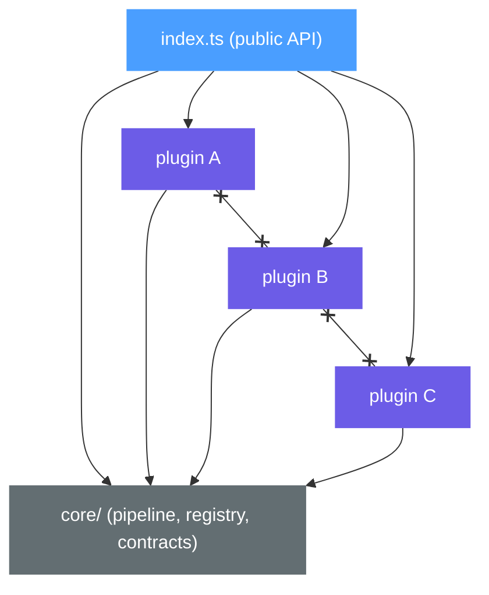

# Plugin Architecture

This guide describes a **suggested** architecture for domain-specific libraries.

It is not required. You are free to organize your library however you see fit. This document offers one approach — Plugin Architecture — that tends to keep domain-specific libraries extensible and maintainable as they grow.

## Overview

Plugin Architecture (also known as Microkernel Architecture) separates a library into a small, stable core and self-contained plugins that extend it. The core defines contracts and orchestrates a pipeline. Plugins implement those contracts to add specific capabilities.

The core ideas are:

- **A minimal core** that owns the pipeline and shared contracts
- **Self-contained plugins** that implement a common interface
- **The core knows nothing about specific plugins** — it delegates through contracts
- **Plugins are added or removed without modifying the core**

## When to Use

This architecture fits libraries that:

- Process input through a pipeline (parse → transform → render)
- Support multiple variants of the same operation (diagram types, language grammars, output formats)
- Need to be extensible by consumers (custom plugins, third-party extensions)

**Examples:** Mermaid (diagram types), highlight.js (language definitions), Vite (build plugins), Marked (renderer extensions), ESLint (lint rules).

## Layers

A domain-specific library using this approach has the following structure inside `src/`:

```tree
src/
├── core/                      # Pipeline, registry, shared contracts
│   ├── types.ts               # Plugin contract and shared types
│   ├── registry.ts            # Plugin registration and lookup
│   ├── pipeline.ts            # Orchestrates input → plugin → output
│   └── index.ts               # Public exports for core
├── plugins/                   # Built-in plugin implementations
│   ├── [plugin-a]/            # One directory per plugin
│   │   ├── parser.ts          # Plugin-specific parsing logic
│   │   ├── renderer.ts        # Plugin-specific rendering logic
│   │   └── index.ts           # Public export (the plugin definition)
│   ├── [plugin-b]/
│   │   ├── parser.ts
│   │   ├── renderer.ts
│   │   └── index.ts
│   └── index.ts               # Re-exports all built-in plugins
└── index.ts                   # Public API of the library
```

### Core

The core provides three things:

1. **A plugin contract** — the interface every plugin must implement
2. **A registry** — stores and looks up registered plugins
3. **A pipeline** — orchestrates the flow from input to output by delegating to the appropriate plugin

The core has zero knowledge of any specific plugin. It only depends on the contract interface.

### Plugins

Each plugin is a self-contained module that implements the plugin contract. A plugin owns all the logic for one specific capability — its parser, transformer, renderer, or whatever the pipeline requires.

Plugins depend on core types only. They never import from other plugins.

## Plugin Contract

The core defines a contract that all plugins must implement:

```typescript
// core/types.ts
export interface PluginDefinition {
  readonly id: string;
  parse(input: string): ASTNode;
  render(ast: ASTNode): string;
}
```

Each built-in plugin implements this contract:

```typescript
// plugins/[plugin-a]/index.ts
import type { PluginDefinition } from "../../core";

export const pluginA: PluginDefinition = {
  id: "plugin-a",
  parse(input) { /* ... */ },
  render(ast) { /* ... */ },
};
```

## Registry

The registry manages plugin registration and lookup:

```typescript
// core/registry.ts
import type { PluginDefinition } from "./types";

const plugins = new Map<string, PluginDefinition>();

export function registerPlugin(plugin: PluginDefinition): void {
  plugins.set(plugin.id, plugin);
}

export function getPlugin(id: string): PluginDefinition | undefined {
  return plugins.get(id);
}
```

## Pipeline

The pipeline orchestrates input through the appropriate plugin:

```typescript
// core/pipeline.ts
import { getPlugin } from "./registry";

export function process(id: string, input: string): string {
  const plugin = getPlugin(id);
  if (!plugin) throw new Error(`Unknown plugin: ${id}`);

  const ast = plugin.parse(input);
  return plugin.render(ast);
}
```

The pipeline never contains plugin-specific logic. It delegates entirely through the contract.

## Dependency Rules



| Layer | Can import from |
| - | - |
| `index.ts` | `core/`, `plugins/`, external packages |
| `plugins/*` | `core/` types only, external packages |
| `core/` | nothing (external packages only) |

**Plugins cannot import from other plugins.** Each plugin is self-contained. If two plugins share logic, extract it into a utility inside `core/` or a shared helper.

**The core cannot import from plugins.** The core defines contracts — plugins implement them. The public API (`index.ts`) registers built-in plugins with the core.

## Consumer Extensibility

Because the contract is public, consumers can create their own plugins:

```typescript
import { registerPlugin, process } from "my-library";

registerPlugin({
  id: "custom",
  parse(input) { /* ... */ },
  render(ast) { /* ... */ },
});

const result = process("custom", input);
```

No changes to the library are required. The contract is the extension point.

## Summary

- A minimal core defines the pipeline and plugin contract
- Plugins implement the contract independently — one module per capability
- The core delegates through contracts, never through concrete implementations
- Plugins cannot depend on each other
- Consumers extend the library by implementing the same contract

For the recommended architecture when building Beat applications rather than libraries, see [Architecture Guide](./clean-architecture).
